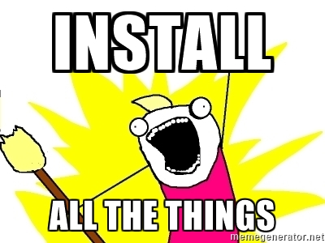

## Installing F#
* Go to [FSharp.org](http://fsharp.org/) Click on "Use F#" and choose the platform.
Yes F# is a cross-platform language.
* Follow Options 2 and 3

## Installing Visual Studio Code
Visual studio code is a free opensource editor that supports many languages
* Go to [Visual Studio Code](https://code.visualstudio.com/) and donwload the lastest version

## Ionide
Ionde Progect is a set of plugings to help develop F# from any platform without the need for the whole Visual Studio. It's compattible with both Athom and VS Code (and maybe others...)
* Open Visual Studio Code and type the shortcut `Ctrl+Shift+P` this will open the command window
* type `in ext` and press `Enter`
* Search for Ionide and Install everything
